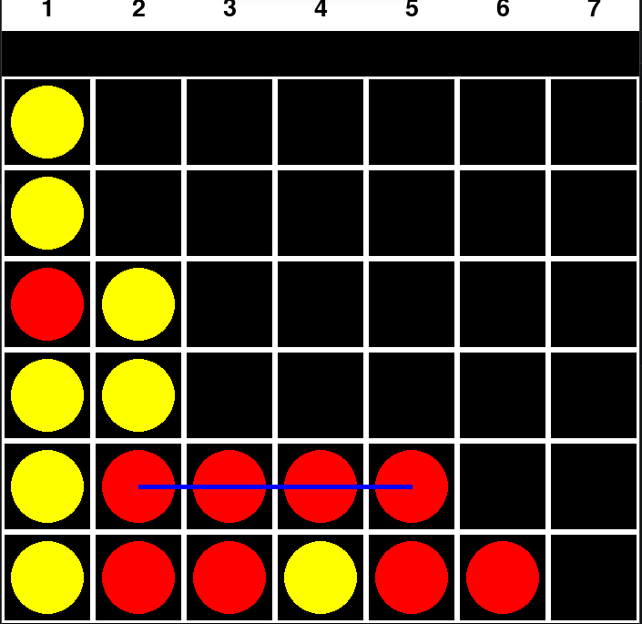

# 🔴 Connect Four with Minimax AI 🟡




A classic Connect Four game built with Python and Pygame, featuring a highly competitive AI opponent powered by the **Minimax algorithm**. This project was developed as a Complex Engineering Problem (CEP) for an Artificial Intelligence course.

## ✨ Features
* **🧠 Intelligent Opponent:** The computer evaluates future game states using the Minimax algorithm to calculate the most optimal move.
* **🎮 Interactive UI:** Fully functional, responsive graphical user interface built from scratch using Pygame.
* **🎨 Player Choice:** Choose to play as Red (First move) or Yellow (Second move).
* **🎯 Win Detection:** Automatically detects horizontal, vertical, and diagonal wins, highlighting the winning connection.

## 🛠️ Tech Stack
* **Language:** Python
* **Library:** Pygame
* **Algorithm:** Minimax with Alpha-Beta Pruning 

## 🚀 Installation & Setup

**1. Clone the repository:**
```bash
git clone [https://github.com/yourusername/connect-four-ai.git](https://github.com/yourusername/connect-four-ai.git)
cd connect-four-ai
2. Set up a virtual environment:

Bash
python -m venv env

# On Windows:
env\Scripts\activate

# On Mac/Linux:
source env/bin/activate
3. Install dependencies:

Bash
pip install -r requirements.txt
4. Run the Game:

Bash
python main.py